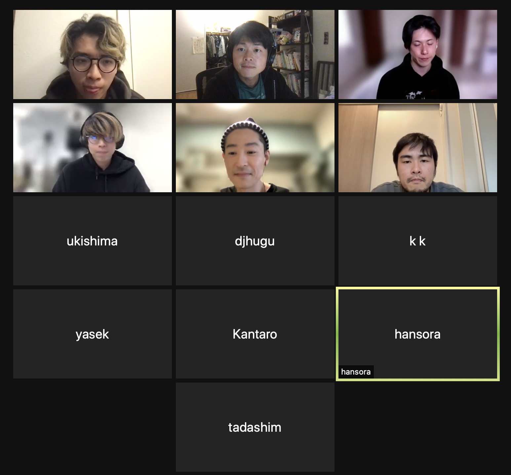

第一回 Dev team meet up
01/30/2022 JST 12:00 (01/29/2022 PST 20:00)
議事録 Tomo

# 参加者

@Shun Kakinoki @ukishima @sakimyto.eth @kk @djhugu @hansora @tadashim
@Hiroyuki@a42 @yasek @kennyt.eth @tomo

# 議題

1. 挨拶・懇親会
2. 現在の Team Dev の状況の共有
3. 今後の構想について・Help のお願い

# アクションプラン

- owner 移行手順を md 形式で PR を出す( @tadashim)
- アイデア取りまとめ場所作る(@kennyt)

# 議事録

## 1. 挨拶・懇親会

- 各自自己紹介しました

## 2. 現在の Team Dev の状況の共有

- wagumi.cat と wagumi の LP ページが稼働している
- エラーハンドリングの対応が足りてない
- github 上に画像データ保持している(月$15 くらいストレージ代にかかっている) => arweave に移行したい。永続的にデータを移したい
  - 1000 枚の画像を metadata.json に変換したい
- kennyt 作成の bot を完成させる
- opensea 上の wagumicatlogo の表示ができていない
  - tadashim: owner 移行の手順を github に作成し、kaki さんと gnosis 管理者が実際に実行する
  - 手順を md にして PR を出す(TODO tadashim)

## 3. 今後の構想について

- Wagumi として最先端を走っていることを示したい
- Discussion
  - idea from kaki https://poc.quest の和組版
  - idea from kaki wagumicat mutant 作成
  - idea from kaki web3 味のある discord bot. 例) forefront の tip を払う bot
  - idea from kaki
    - wagumi からでたプロダクトのインキュベーション
  - idea from Tomo コントラクトリーディング https://github.com/MolochVentures/moloch とか
  - idea from ukishima コミュニティの基礎知識を底上げする/足並みを揃える
    - 現状は誰がどの程度の知識があるのかわからないので、なにかを依頼するにしても偏ってしまう
    - コードリーディングするにしてもレベル分けは必要かも
  - idea from tadashim それぞれのレベルが違うので、ハードルがなにかを知りたい
  - idea feedback from yuta
    - スマートコントラクトは重要そうだったので wagumi の方にコントリビュートするのはためらってしまった。ガイドとかあると参加しやすい。
  - idea from Hiroyuki
    - 同じ興味を持っている人で working group 作る(例. ZKP 勉強会)
  - idea from kennyt
    - アイデアを取りまとめる場所が必要そう(Notion とか)
  - idea from ukishima
    - 今はちょっと忙しいが、将来的に勉強会の講師として貢献できる

# 様子

